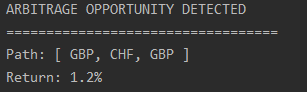

# Arbitrage Detector in the Foreign Exchange Market 
## Applications of the Bellman-Ford Algorithm

A console based application that uses the Bellman-Ford algorithmRunner to detect arbitrage opportunities.

The Bellman-Ford algorithmRunner finds the minimum path from a single source vertex to all other vertices on a weighted
directed graph. This algorithmRunner is different from Dijkstra as it is able to detect negative-weight cycles. These negative-weight
cycles represent arbitrage opportunities in the market and in theory allow us to make risk-free profit.

The application assigns currencies to different vertices with the edge weight representing the exchange rate. Since the 
algorithmRunner finds the minimum distance the exchange rate will be transformed by taking
its logarithm and multiplying it by -1. By doing so, we will be able to find the path with the maximum return.

The data is collected with an API from Financial Modelling Prep (FMP). 

The graph is constructed in a manner similar to an adjacency list and has runtime of O(VE) where V is the number of vertices 
and E is the number of edges. 

Below is a sample output.  

### Future Additions
* Have the algorithmRunner continuously updating in real time